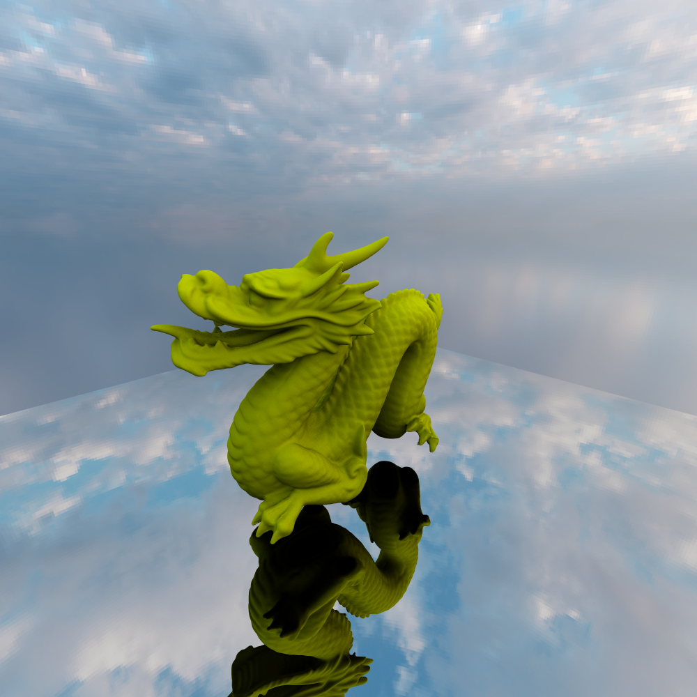

# 一个基于物理着色的光线追踪器

本项目是一个初始的版本，目前实现了一个 Whitted-Style 的光线追踪器，能够渲染包含复杂几何体、多种材质和光源的场景，并使用 BVH 树进行渲染加速。

## 核心特性 (Features)

- **渲染算法**: 实现了 Whitted-Style 递归光线追踪，支持阴影、理想镜面反射。
- **加速结构**: 使用 **BVH (Bounding Volume Hierarchy)** 来加速光线与场景的求交运算，支持对大量（如 `.ply` 模型）图元进行高效渲染。
- **几何体**:
  - 基础图元：球体 (`Sphere`)、三角形 (`Triangle`)。
  - 模型加载：支持简单的 `.ply` 文件格式读取，可以渲染复杂模型（如 Stanford Dragon）。
- **材质系统**:
  - 漫反射材质 (`MatteMaterial`)。
  - 理想镜面反射材质 (`Mirror`)。
  - 包含 **Fresnel (菲涅尔) 效应**计算 (`Fresnel.h`)，以实现更真实的反射。
- **光源**:
  - 点光源 (`PointLight`)。
  - 面光源 (`DiffuseLight` / Area Light)。
  - **基于图像的照明 (IBL)**: 实现了 `SkyBoxLight`，支持加载 `.hdr` (高动态范围) 环境贴图作为天空盒，提供真实的环境光照。
- **采样与积分**:
  - 实现了蒙特卡洛积分器 (`Integrator`) 基类。
  - 支持**低差异序列 (Low-Discrepancy Sequences)** 采样，包括 `Halton` 和 `Sobol` 采样器，以获得更快的收敛速度和更高质量的抗锯齿效果。
- **相机**:
  - 透视相机 (`PerspectiveCamera`)。
  - 正交相机 (`OrthographicCamera`)。

## 项目结构

```
.
├── Accelerator/   # 加速结构
│   └── BVHAccel.h/cpp
├── Camera/        # 相机模型
│   ├── Perspective.h/cpp
│   └── Orthographic.h/cpp
├── Core/          # 渲染器核心类
│   ├── Scene.h/cpp        (场景)
│   ├── Primitive.h/cpp    (图元)
│   ├── Interaction.h/cpp  (光线交点信息)
│   ├── Spectrum.h/cpp     (光谱/颜色)
│   ├── Transform.h/cpp    (变换)
│   ├── FrameBuffer.h/cpp  (帧缓冲/画布)
│   ├── Geometry.h/cpp       (几何学基础)
│   └── PBR.h            (PBR相关定义、前向声明)
├── include/       # 外部依赖
│   └── stb_image.h/write.h
├── Integrator/    # 积分器 (渲染算法)
│   └── WhittedIntegrator.h/cpp
├── Light/         # 光源
│   ├── PointLight.h/cpp
│   ├── DiffuseLight.h/cpp (面光源)
│   └── SkyBoxLight.h/cpp  (天空盒)
├── Material/      # 材质模型
│   ├── MatteMaterial.h/cpp
│   ├── Mirror.h/cpp
│   └── Fresnel.h/cpp
├── Sampler/       # 采样器
│   ├── Sampler.h/cpp
│   ├── Halton.h/cpp
│   └── SobolMatrices.h/cpp
├── Shape/         # 几何形状
│   ├── Sphere.h/cpp
│   ├── Triangle.h/cpp
│   └── plyRead.h
├── Texture/       # 纹理
│   └── ConstantTexture.h/cpp
├── Resources/     # 资源文件 (.hdr, .ply 等)
└── Main/
    └── main.cpp     (主程序入口)
```

## 使用渲染器输出的示例



## 未来

这将是一个不断完善的项目。
