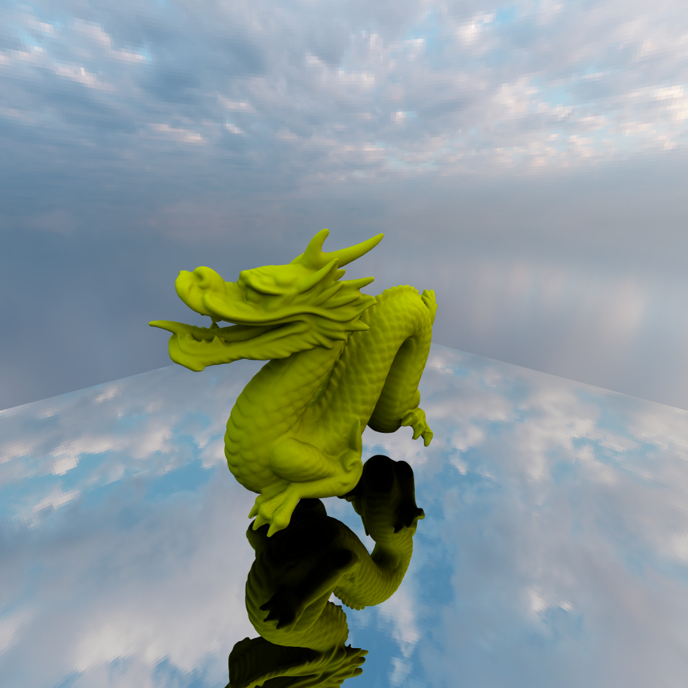
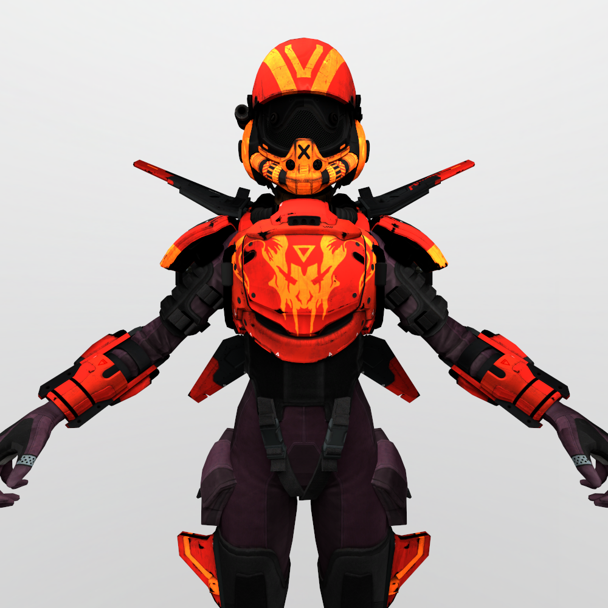

# 一个基于物理着色的光线追踪器

本项目是一个初始的版本，目前实现了一个 Whitted-Style 的光线追踪器，能够渲染包含复杂几何体、多种材质和光源的场景，并使用 BVH 树进行渲染加速。

## 核心特性 (Features)

- **渲染算法**: 实现了 Whitted-Style 递归光线追踪，支持阴影、理想镜面反射。
- **加速结构**: 使用 **BVH (Bounding Volume Hierarchy)** 来加速光线与场景的求交运算，支持对大量（如 `.ply` 模型）图元进行高效渲染。
- **几何体**:
  - 基础图元：球体 (`Sphere`)、三角形 (`Triangle`)。
  - 模型加载：支持简单的 `.ply` 文件格式读取，可以渲染复杂模型（如 Stanford Dragon）。
- **材质系统**:
  - 漫反射材质 (`MatteMaterial`)。
  - 理想镜面反射材质 (`Mirror`)。
  - 包含 **Fresnel (菲涅尔) 效应**计算 (`Fresnel.h`)，以实现更真实的反射。
- **光源**:
  - 点光源 (`PointLight`)。
  - 面光源 (`DiffuseLight` / Area Light)。
  - **基于图像的照明 (IBL)**: 实现了 `SkyBoxLight`，支持加载 `.hdr` (高动态范围) 环境贴图作为天空盒，提供真实的环境光照。
- **采样与积分**:
  - 实现了蒙特卡洛积分器 (`Integrator`) 基类。
  - 支持**低差异序列 (Low-Discrepancy Sequences)** 采样，包括 `Halton` 和 `Sobol` 采样器，以获得更快的收敛速度和更高质量的抗锯齿效果。
- **相机**:
  - 透视相机 (`PerspectiveCamera`)。
  - 正交相机 (`OrthographicCamera`)。

## 核心特性-V2

随着项目的迭代，渲染器已从 Whitted-Style 升级为完整的基于物理的路径追踪器 (PBRT)，并添加了以下高级功能：

* **渲染算法**:  `Integrator` 模块现在包含多种渲染算法：
    * `DirectLightingIntegrator` (直接光照积分器): 一种非递归的积分器，仅计算直接光照，用于调试和性能对比。
    * `PathIntegrator` (路径追踪器): 支持全局光照，通过蒙特卡洛方法求解渲染方程，实现精确的间接光照。
    * `VolPathIntegrator` (体积路径追踪器): 在 `PathIntegrator` 基础上增加了对参与介质 的支持。
* **PBR 材质系统**: 引入了基于**微表面理论 (Microfacet Theory)** 的现代 PBR 材质，取代了 V1 的简单材质：
    * 实现了 `MetalMaterial` (金属)、`GlassMaterial` (玻璃) 和 `PlasticMaterial` (塑料) 等。
    * 核心在于 `Microfacet.h`，它定义了微表面分布函数 (Trowbridge-Reitz / GGX) 和遮挡-阴影项 (Smith G1)。
    * 能够通过“粗糙度” (Roughness) 参数控制表面从光滑镜面到粗糙漫反射的平滑过渡。
* **参与介质 (Volume Rendering)**: 新增 `Media` 模块，支持光线在介质中传播：
    * 实现了 `HomogeneousMedium` (均匀介质) 和 `GridDensityMedium` (栅格密度介质)。
* **高级纹理 (Advanced Texturing)**:
    * `Texture` 模块已扩展，支持 `ImageTexture` (图像纹理) 加载。
    * 实现了 `MIPMap` (多级渐远纹理) 来进行高质量的纹理抗锯齿过滤。
* **光线微分 (Ray Differentials)**:
    * `Camera` (相机) 系统现在支持生成**光线微分** (`ray.dx`, `ray.dy`)。
    * 这些微分信息在光线追踪中传递，用于在 `SurfaceInteraction` 处计算像素在 UV 空间上的“足迹” (footprint)，以供 `MIPMap` 查询正确的层级，实现高质量的纹理过滤。
* **高级天空盒**:
    * 实现 `InfiniteAreaLight` (无限面光源)。
    * 利用 `LightDistrib` (2D 光源分布) 对 HDR 环境贴图进行预处理，实现了基于亮度的**重要性采样 (Importance Sampling)**，大幅提升了 IBL 的收敛速度，显著减少噪点。
* **模型加载**: 新增 `ModelLoad` 抽象，提供了比 `plyRead.h` 更通用的复杂模型加载和管理功能。
* **其他**：增加了色调映射处理。这能将渲染出的高动态范围 (HDR) `Spectrum` 颜色平滑地压缩到 0-255 范围内，防止高光区域过曝截断，保留更多亮部和暗部细节。

## 项目结构

（已根据 V2 文件列表更新）

```
.
├── Accelerator/
│   ├── BVHAccel.cpp
│   ├── BVHAccel.h
│   └── README.md
├── Camera/
│   ├── Camera.cpp
│   ├── Camera.h
│   ├── Orthographic.cpp
│   ├── Orthographic.h
│   ├── Perspective.cpp
│   ├── Perspective.h
│   └── README.md
├── Core/
│   ├── FrameBuffer.cpp
│   ├── FrameBuffer.h
│   ├── Geometry.h
│   ├── Interaction.cpp
│   ├── Interaction.h
│   ├── Memory.h
│   ├── PBR.h
│   ├── Primitive.cpp
│   ├── Primitive.h
│   ├── README.md
│   ├── Scene.cpp
│   ├── Scene.h
│   ├── Spectrum.cpp
│   ├── Spectrum.h
│   ├── Transform.cpp
│   └── Transform.h
├── include/
│   ├── stb_image.h
│   ├── stb_image_resize.h
│   └── stb_image_write.h
├── Integrator/
│   ├── DirectLightingIntegrator.cpp
│   ├── DirectLightingIntegrator.h
│   ├── Integrator.cpp
│   ├── Integrator.h
│   ├── PathIntegrator.cpp
│   ├── PathIntegrator.h
│   ├── README.md
│   ├── VolPathIntegrator.cpp
│   ├── VolPathIntegrator.h
│   ├── WhittedIntegrator.cpp
│   └── WhittedIntegrator.h
├── Light/
│   ├── DiffuseLight.cpp
│   ├── DiffuseLight.h
│   ├── InfiniteAreaLight.cpp
│   ├── InfiniteAreaLight.h
│   ├── Light.cpp
│   ├── Light.h
│   ├── LightDistrib.cpp
│   ├── LightDistrib.h
│   ├── PointLight.cpp
│   ├── PointLight.h
│   ├── README.md
│   ├── SkyBoxLight.cpp
│   └── SkyBoxLight.h
├── Main/
│   ├── main.cpp
│   └── README.md
├── Material/
│   ├── Fresnel.cpp
│   ├── Fresnel.h
│   ├── GlassMaterial.cpp
│   ├── GlassMaterial.h
│   ├── Material.cpp
│   ├── Material.h
│   ├── MatteMaterial.cpp
│   ├── MatteMaterial.h
│   ├── MetalMaterial.cpp
│   ├── MetalMaterial.h
│   ├── Microfacet.cpp
│   ├── Microfacet.h
│   ├── Mirror.cpp
│   ├── Mirror.h
│   ├── PlasticMaterial.cpp
│   ├── PlasticMaterial.h
│   ├── README.md
│   ├── Reflection.cpp
│   └── Reflection.h
├── Media/
│   ├── GridDensityMedium.cpp
│   ├── GridDensityMedium.h
│   ├── HomogeneousMedium.cpp
│   ├── HomogeneousMedium.h
│   ├── Medium.cpp
│   └── Medium.h
├── Sampler/
│   ├── ClockRand.cpp
│   ├── ClockRand.h
│   ├── Halton.cpp
│   ├── Halton.h
│   ├── LowDiscrepancy.cpp
│   ├── LowDiscrepancy.h
│   ├── README.md
│   ├── RNG.h
│   ├── Sampler.cpp
│   ├── Sampler.h
│   ├── Sampling.cpp
│   ├── Sampling.h
│   ├── SobolMatrices.cpp
│   └── SobolMatrices.h
├── Shape/
│   ├── ModelLoad.cpp
│   ├── ModelLoad.h
│   ├── plyRead.h
│   ├── README.md
│   ├── Shape.cpp
│   ├── Shape.h
│   ├── Sphere.cpp
│   ├── Sphere.h
│   ├── Triangle.cpp
│   └── Triangle.h
└── Texture/
    ├── ConstantTexture.cpp
    ├── ConstantTexture.h
    ├── ImageTexture.cpp
    ├── ImageTexture.h
    ├── MIPMap.cpp
    ├── MIPMap.h
    ├── README.md
    ├── Texture.cpp
    └── Texture.h
```

## 使用渲染器输出的示例

V1:



V2:



## 未来

这将是一个不断完善的项目。
